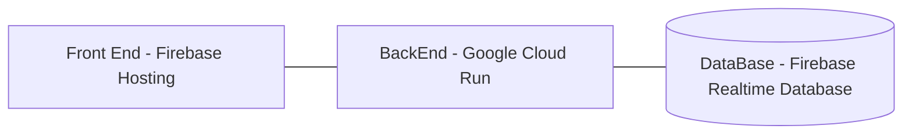

# Rent Roll Reader

This is a web app designed to take PDFs or Images of Rent Roll Documents, then parse them using pdfminer or OCR, calculate additional rates based on given data, and store them server-side. Users can then access their rent roll data.

## How it works

