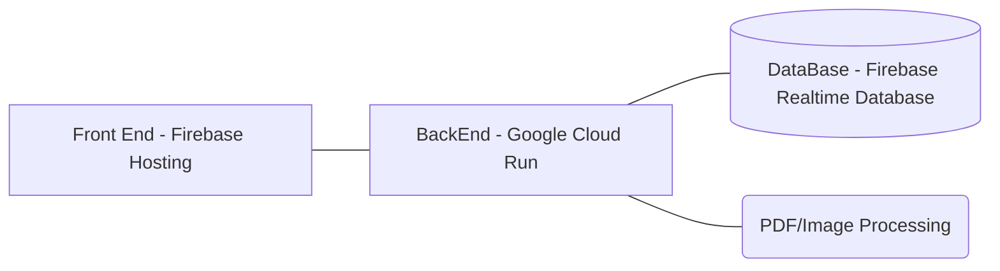

# Rent Roll Reader

This is a web app designed to take PDFs or Images of Rent Roll Documents, then parse them using pdfminer or OCR, calculate additional rates based on given data, and store them server-side. Users can then access their rent roll data.

## How it works

First an image or pdf is uploaded to the front-end hosted on Firebase. When this file is uploaded, a POST request is send to the Python backend hosted on Cloud Run, which recieves it using the Flask library. PDF files are read using pdfminer-six, using the appropriate input parameters for the uploaded template. Image files (png/jpeg) are processed using Tesseract OCR, specifically pytesseract. Data from either processing is saved in JSON format, then uploaded to the Firebase Database. After this a GET request is automatically send to the backend. The backend makes a request to the database for the Rent Rolls the user has access to (including the one just uploaded) and then sends them to the front-end to be displayed.