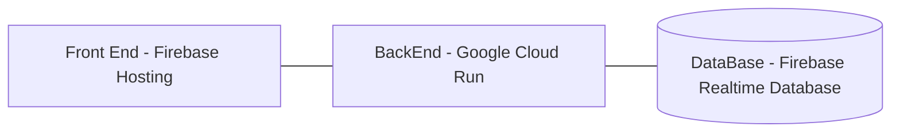

# Rent Roll Reader

This is a web app designed to take PDFs or Images of Rent Roll Documents, then parse them using pdfminer or OCR, calculate additional rates based on given data, and store them server-side. Users can then access their rent roll data.

## How it works

*TODO: Add diagram*
Diagram:

An image or pdf is uploaded on the front end website. This is passed to either pdfminer.six for pdf reading or pytesseract or image reading. The data is parsed into a json file for calculations and storage on the Firebase Database.